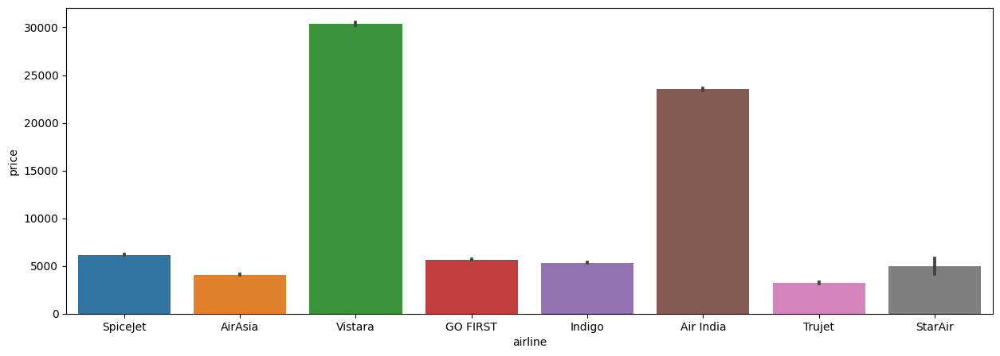
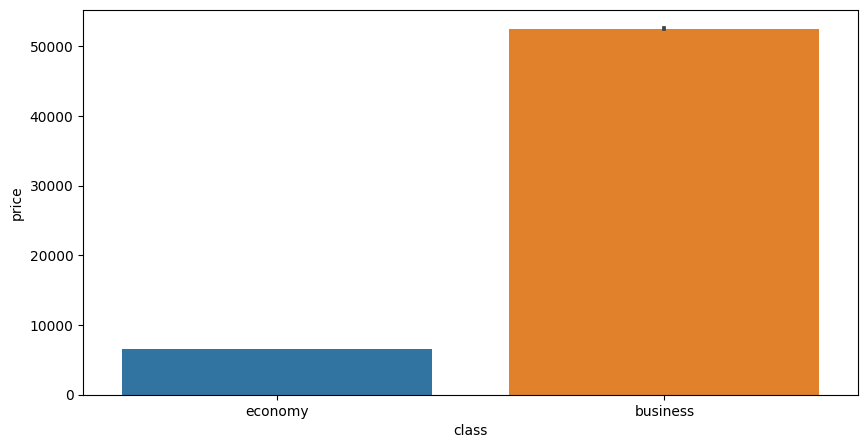
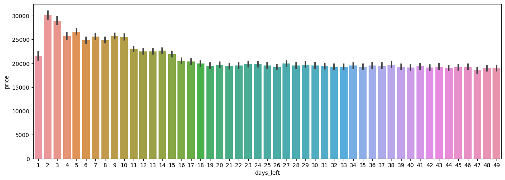
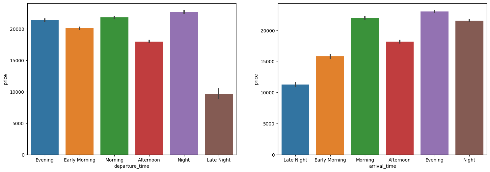
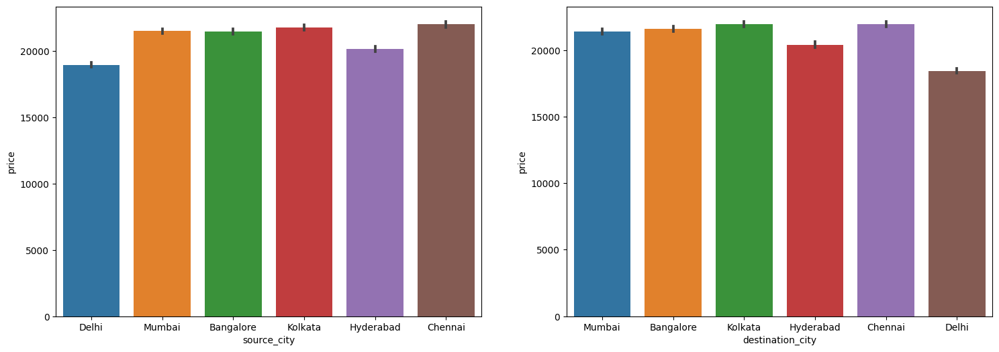

# ✈️ Flight Price Prediction

> Machine Learning project for predicting airline ticket prices
> using flight characteristics and booking information


---

## 📌 Objective

To develop a machine learning model capable of predicting airline ticket prices based on factors such as airline, route, departure and arrival schedules, travel duration, number of stops, travel class, and days remaining before departure.

---

## 📂 Dataset Overview

| Feature | Description |
|----------|------------|
| Airline | Airline operating the flight |
| Flight | Flight identifier |
| Source City | Departure city |
| Destination City | Arrival city |
| Departure Time | Scheduled departure time |
| Arrival Time | Scheduled arrival time |
| Stops | Number of stops |
| Duration | Total travel duration |
| Class | Economy or Business |
| Days Left | Days remaining before departure |
| Price | Flight ticket price |

**Scale:** 300,000+ flight records across Economy and Business classes

---

## 🗂️ Project Workflow

```text
Flight Booking Dataset
            ↓
Data Collection & Loading
            ↓
Data Understanding
            ↓
Data Cleaning & Preprocessing
            ↓
Feature Engineering
            ↓
Exploratory Data Analysis (EDA)
            ↓
Feature Encoding & Scaling
            ↓
Model Development
            ↓
Model Evaluation
            ↓
Prediction & Insights
```

---

## 🛠️ Skills & Tools

| Category | Details |
|---|---|
| Language | Python |
| Data Manipulation | Pandas, NumPy |
| Visualisation | Matplotlib, Seaborn |
| Machine Learning | Scikit-Learn |
| Techniques | Data Cleaning, Feature Engineering, EDA, Regression Modeling |
| Environment | Jupyter Notebook |

---

## 📊 Visualisations

### 01 — Airline-wise Average Price


### 02 — Travel Class vs Price


### 03 — Days Left vs Ticket Price


### 04 — Departure & Arrival Time vs Average Ticket Price


### 05 — Source & Destination City vs Average Ticket Price


---

## 🤖 Machine Learning Models

The following regression models were trained and evaluated:

- Linear Regression
- Decision Tree Regressor
- Random Forest Regressor
- K-Nearest Neighbors Regressor

---

## 📈 Model Performance

| Model | R² Score |
|---------|---------|
| Linear Regression | 0.909 |
| Decision Tree Regressor | 0.976 |
| Random Forest Regressor | **0.985** |
| K-Nearest Neighbors Regressor | 0.972 |

🏆 **Best Model:** Random Forest Regressor

---

## 🔍 Key Findings

- ✈️ Ticket prices vary significantly based on airline, travel class, route, duration, and number of stops.
- 📅 Flight fares generally increase as the departure date approaches, making booking lead time an important pricing factor.
- 💼 Business-class tickets are substantially more expensive than economy-class tickets across most routes.
- 🤖 Random Forest Regressor achieved the highest predictive performance with an R² score of approximately 98.5%.
- 📊 Airline, travel class, duration, and days left before departure emerged as strong predictors of ticket price.

---

## 📝 Note

This repository showcases the source notebook, project methodology, business findings, 
and visual outputs. The raw dataset is intentionally excluded from the public repository. 
Cell outputs were cleared before upload to keep the repository lightweight; all visualizations 
and key findings are available in the README and plots folder. Project walkthroughs and 
technical discussions are available upon request.

---

## 👤 Author

**Victor Sarmacharjee**  
Aspiring Data Analyst

[LinkedIn](https://www.linkedin.com/in/victorsa09/)
